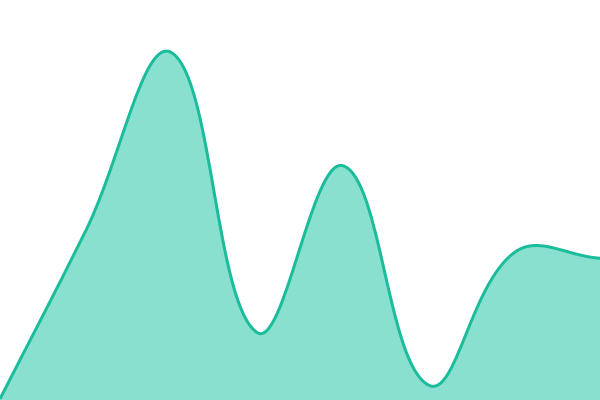
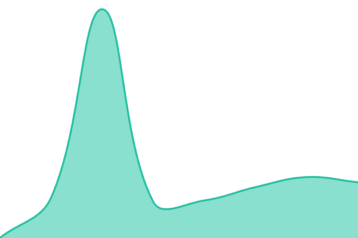
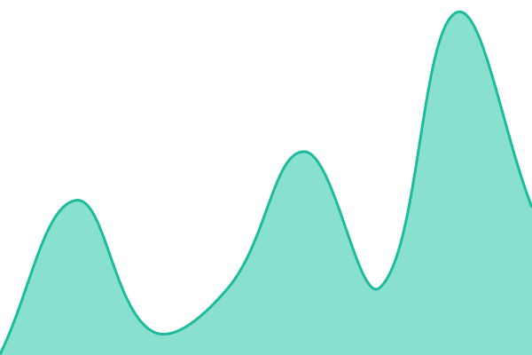

# [📈 Live Status](https://demo.upptime.js.org): <!--live status--> **🟧 Partial outage**

This repository contains the open-source uptime monitor and status page for [sabrina](https://demo.upptime.js.org), powered by [Upptime](https://github.com/upptime/upptime).

With [Upptime](https://upptime.js.org), you can get your own unlimited and free uptime monitor and status page, powered entirely by a GitHub repository. We use [Issues](https://github.com/sabrina/upptime/issues) as incident reports, [Actions](https://github.com/sabrina/upptime/actions) as uptime monitors, and [Pages](https://demo.upptime.js.org) for the status page.

<!--start: status pages-->
<!-- This summary is generated by Upptime (https://github.com/upptime/upptime) -->
<!-- Do not edit this manually, your changes will be overwritten -->
<!-- prettier-ignore -->
| URL | Status | History | Response Time | Uptime |
| --- | ------ | ------- | ------------- | ------ |
|  [Backend_HTTP_apollo.hzgelf.com](https://apollo.hzgelf.com) | 🟥 Down | [backend-http-apollo-hzgelf-com.yml](https://github.com/sabbygorl/sabbygorl.github.io/commits/HEAD/history/backend-http-apollo-hzgelf-com.yml) | 

 726ms
     
 | 

<a href="https://sabbygorl.github.io/sabbygorl.github.io/history/backend-http-apollo-hzgelf-com">0.00%</a>
    

|  [BACKEND_HTTP_apollo2.all5555.com](https://apollo2.all5555.com) | 🟥 Down | [backend-http-apollo2-all5555-com.yml](https://github.com/sabbygorl/sabbygorl.github.io/commits/HEAD/history/backend-http-apollo2-all5555-com.yml) | 

 704ms
     
 | 

<a href="https://sabbygorl.github.io/sabbygorl.github.io/history/backend-http-apollo2-all5555-com">0.00%</a>
    

|  [Backend_HTTP_grp-api.haa477.com](https://grp-api.haa477.com) | 🟥 Down | [backend-http-grp-api-haa477-com.yml](https://github.com/sabbygorl/sabbygorl.github.io/commits/HEAD/history/backend-http-grp-api-haa477-com.yml) | 

 845ms
     
 | 

<a href="https://sabbygorl.github.io/sabbygorl.github.io/history/backend-http-grp-api-haa477-com">0.00%</a>
    

|  [Backend_HTTP_live-api.673ing.com](https://live-api.673ing.com:18088) | 🟥 Down | [backend-http-live-api-673ing-com.yml](https://github.com/sabbygorl/sabbygorl.github.io/commits/HEAD/history/backend-http-live-api-673ing-com.yml) | 

 604ms
     
 | 

<a href="https://sabbygorl.github.io/sabbygorl.github.io/history/backend-http-live-api-673ing-com">0.00%</a>
    

|  [Backend_HTTP_live-api.hzgelf.com](https://live-api.hzgelf.com:18088) | 🟥 Down | [backend-http-live-api-hzgelf-com.yml](https://github.com/sabbygorl/sabbygorl.github.io/commits/HEAD/history/backend-http-live-api-hzgelf-com.yml) | 

 722ms
     
 | 

<a href="https://sabbygorl.github.io/sabbygorl.github.io/history/backend-http-live-api-hzgelf-com">0.00%</a>
    

|  [Backend_HTTP_prod-slot-api.673ing.com](https://prod-slot-api.673ing.com:8082) | 🟩 Up | [backend-http-prod-slot-api-673ing-com.yml](https://github.com/sabbygorl/sabbygorl.github.io/commits/HEAD/history/backend-http-prod-slot-api-673ing-com.yml) | 

 609ms
     
 | 

<a href="https://sabbygorl.github.io/sabbygorl.github.io/history/backend-http-prod-slot-api-673ing-com">100.00%</a>
    

|  [Backoffice_HTTP_gameapp.673ing.com](https://gameapp.673ing.com:12356) | 🟥 Down | [backoffice-http-gameapp-673ing-com.yml](https://github.com/sabbygorl/sabbygorl.github.io/commits/HEAD/history/backoffice-http-gameapp-673ing-com.yml) | 

 547ms
     
 | 

<a href="https://sabbygorl.github.io/sabbygorl.github.io/history/backoffice-http-gameapp-673ing-com">0.00%</a>
    

|  [Backoffice_HTTP_grp-backoffice.haa477.com](https://grp-backoffice.haa477.com) | 🟩 Up | [backoffice-http-grp-backoffice-haa477-com.yml](https://github.com/sabbygorl/sabbygorl.github.io/commits/HEAD/history/backoffice-http-grp-backoffice-haa477-com.yml) | 

 947ms
     
 | 

<a href="https://sabbygorl.github.io/sabbygorl.github.io/history/backoffice-http-grp-backoffice-haa477-com">100.00%</a>
    

|  [Backoffice_HTTP_hera.all5555.com](https://hera.all5555.com) | 🟥 Down | [backoffice-http-hera-all5555-com.yml](https://github.com/sabbygorl/sabbygorl.github.io/commits/HEAD/history/backoffice-http-hera-all5555-com.yml) | 

 601ms
     
 | 

<a href="https://sabbygorl.github.io/sabbygorl.github.io/history/backoffice-http-hera-all5555-com">0.00%</a>
    

|  [Backoffice_HTTP_hera.hzgelf.com](https://hera.hzgelf.com) | 🟩 Up | [backoffice-http-hera-hzgelf-com.yml](https://github.com/sabbygorl/sabbygorl.github.io/commits/HEAD/history/backoffice-http-hera-hzgelf-com.yml) | 

 1240ms
     
 | 

<a href="https://sabbygorl.github.io/sabbygorl.github.io/history/backoffice-http-hera-hzgelf-com">100.00%</a>
    

|  [Backoffice_HTTP_media.hzgelf.com](https://media.hzgelf.com) | 🟥 Down | [backoffice-http-media-hzgelf-com.yml](https://github.com/sabbygorl/sabbygorl.github.io/commits/HEAD/history/backoffice-http-media-hzgelf-com.yml) | 

 342ms
     
 | 

<a href="https://sabbygorl.github.io/sabbygorl.github.io/history/backoffice-http-media-hzgelf-com">0.00%</a>
    

|  [Backoffice_HTTP_media.pwqr820.com](https://media.pwqr820.com) | 🟥 Down | [backoffice-http-media-pwqr820-com.yml](https://github.com/sabbygorl/sabbygorl.github.io/commits/HEAD/history/backoffice-http-media-pwqr820-com.yml) | 

 296ms
     
 | 

<a href="https://sabbygorl.github.io/sabbygorl.github.io/history/backoffice-http-media-pwqr820-com">0.00%</a>
    

|  [Frontend_HTTP_prod-slot-game.673ing.com](https://prod-slot-game.673ing.com) | 🟩 Up | [frontend-http-prod-slot-game-673ing-com.yml](https://github.com/sabbygorl/sabbygorl.github.io/commits/HEAD/history/frontend-http-prod-slot-game-673ing-com.yml) | 

 470ms
     
 | 

<a href="https://sabbygorl.github.io/sabbygorl.github.io/history/frontend-http-prod-slot-game-673ing-com">100.00%</a>
    

|  [Frontend_HTTP_grp-portal.haa477.com](https://grp-portal.haa477.com) | 🟩 Up | [frontend-http-grp-portal-haa477-com.yml](https://github.com/sabbygorl/sabbygorl.github.io/commits/HEAD/history/frontend-http-grp-portal-haa477-com.yml) | 

 973ms
     
 | 

<a href="https://sabbygorl.github.io/sabbygorl.github.io/history/frontend-http-grp-portal-haa477-com">100.00%</a>
    

|  [Frontend_HTTP_live2.673ing.com](https://live2.673ing.com) | 🟥 Down | [frontend-http-live2-673ing-com.yml](https://github.com/sabbygorl/sabbygorl.github.io/commits/HEAD/history/frontend-http-live2-673ing-com.yml) | 

 612ms
     
 | 

<a href="https://sabbygorl.github.io/sabbygorl.github.io/history/frontend-http-live2-673ing-com">0.00%</a>
    

|  [Frontend_HTTP_live2.hzgelf.com](https://live2.hzgelf.com) | 🟥 Down | [frontend-http-live2-hzgelf-com.yml](https://github.com/sabbygorl/sabbygorl.github.io/commits/HEAD/history/frontend-http-live2-hzgelf-com.yml) | 

 944ms
     
 | 

<a href="https://sabbygorl.github.io/sabbygorl.github.io/history/frontend-http-live2-hzgelf-com">0.00%</a>
    

|  [media.673ing.com](https://media.673ing.com) | 🟥 Down | [media-673ing-com.yml](https://github.com/sabbygorl/sabbygorl.github.io/commits/HEAD/history/media-673ing-com.yml) | 

 327ms
     
 | 

<a href="https://sabbygorl.github.io/sabbygorl.github.io/history/media-673ing-com">0.00%</a>
    

|  [Cagayan_PING_103.29.22.99_FCCDI](tcp-ping://103.29.22.99) | 🟥 Down | [cagayan-ping-103-29-22-99-fccdi.yml](https://github.com/sabbygorl/sabbygorl.github.io/commits/HEAD/history/cagayan-ping-103-29-22-99-fccdi.yml) | 

 0ms
     
 | 

<a href="https://sabbygorl.github.io/sabbygorl.github.io/history/cagayan-ping-103-29-22-99-fccdi">0.00%</a>
    

|  [Cagayan_PING_136.239.236.27_CONVERGE](tcp-ping://136.239.236.27) | 🟥 Down | [cagayan-ping-136-239-236-27-converge.yml](https://github.com/sabbygorl/sabbygorl.github.io/commits/HEAD/history/cagayan-ping-136-239-236-27-converge.yml) | 

 0ms
     
 | 

<a href="https://sabbygorl.github.io/sabbygorl.github.io/history/cagayan-ping-136-239-236-27-converge">0.00%</a>
    

|  [Cagayan_PING_43.247.19.170_BLACKFIBER](tcp-ping://43.247.19.170) | 🟥 Down | [cagayan-ping-43-247-19-170-blackfiber.yml](https://github.com/sabbygorl/sabbygorl.github.io/commits/HEAD/history/cagayan-ping-43-247-19-170-blackfiber.yml) | 

 0ms
     
 | 

<a href="https://sabbygorl.github.io/sabbygorl.github.io/history/cagayan-ping-43-247-19-170-blackfiber">0.00%</a>
    

|  [PING_Studio.hzgelf.com](tcp-ping://studio.hzgelf.com) | 🟥 Down | [ping-studio-hzgelf-com.yml](https://github.com/sabbygorl/sabbygorl.github.io/commits/HEAD/history/ping-studio-hzgelf-com.yml) | 

 0ms
     
 | 

<a href="https://sabbygorl.github.io/sabbygorl.github.io/history/ping-studio-hzgelf-com">0.00%</a>
    

<!--end: status pages-->

[**Visit our status website →**](https://demo.upptime.js.org)

## 📄 License

- Powered by: [Upptime](https://github.com/upptime/upptime)
- Code: [MIT](./LICENSE) © [Anand Chowdhary](https://anandchowdhary.com), supported by [Pabio](https://pabio.com)
- Data in the `./history` directory: [Open Database License](https://opendatacommons.org/licenses/odbl/1-0/)
